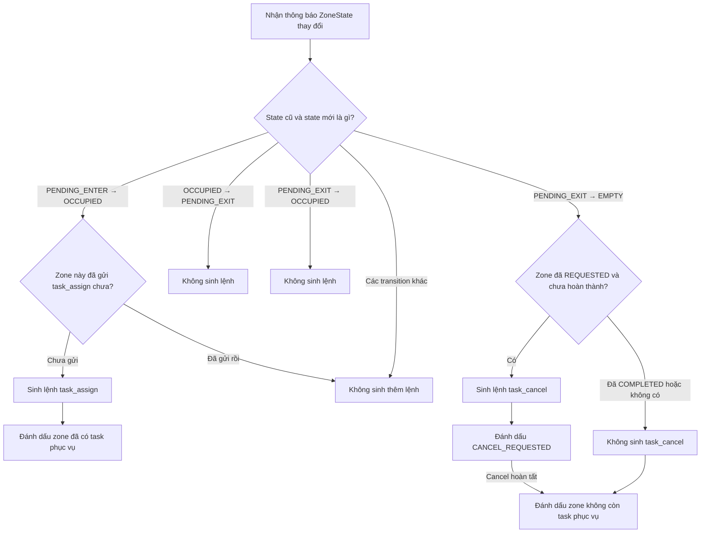

## Trách nhiệm của module

`dispatch_decision` theo dõi transition trạng thái zone và sinh một trong hai
quyết định `TASK_ASSIGN` hoặc `TASK_CANCEL`. Module này không chọn robot, không
cấp `task_id` và không trực tiếp gửi message tới robot.

Các thành phần chính:

- `DispatchDecisionEngine`: điều phối việc đọc state, gọi policy, cập nhật state
  và trả về các `DispatchDecision` phát sinh.
- `ZoneOnlyDecisionPolicy`: sinh action chỉ từ transition và service của zone.
- `ReIdDecisionPolicy`: sinh action từ transition, identity và trạng thái phục
  vụ toàn cục của người.
- `ZoneDecisionStateStore`: lưu trạng thái zone và trạng thái phục vụ gần
  nhất của từng zone.
- `PersonServiceStateStore`: lưu `REQUESTED`/`SERVED` theo `global_id` để ngăn
  một người được mời đồng thời hoặc được mời lại sau khi đã phục vụ xong.
- `select_zone_person`: chọn detection đã có `global_id` và similarity cao nhất
  trong zone; dùng confidence để phân hạng khi similarity bằng nhau.

## Chế độ ReID

Runtime chọn policy qua section `robot_dispatch`. `use_reid` mặc định là
`false` để giữ nguyên flow zone-only:

```yaml
reid:
  enabled: true

robot_dispatch:
  enabled: true
  use_reid: true
```

Khi `use_reid: true`, `reid.enabled` cũng phải là `true`; runtime sẽ từ
chối cấu hình không nhất quán trước khi kết nối UART.

Khởi tạo engine với policy bật ReID:

```python
engine = DispatchDecisionEngine(
    policy=ReIdDecisionPolicy(),
)
```

Khi xử lý zone, truyền detections đã được ReID enrich và danh sách tên zone có
cùng thứ tự:

```python
decisions = engine.process_zones(
    zones,
    detections=detection_frame.detections,
    zone_names=zone_names,
)
```

Nếu transition `PENDING_ENTER → OCCUPIED` chưa có người với `global_id`, zone
được đánh dấu `awaiting_identity`. Trạng thái này được giữ qua dao động
`OCCUPIED ↔ PENDING_EXIT`, rồi xóa khi sinh `TASK_ASSIGN` hoặc zone về `EMPTY`.

Khi sinh `TASK_ASSIGN`, `DispatchDecision` mang theo `person_global_id`,
`person_similarity` và `person_track_id`. Global ID được đánh dấu `REQUESTED`
ngay lúc sinh decision để chặn task trùng ở mọi zone. Khi robot báo hoàn thành,
`on_service_completed(zone_id)` chuyển người sang `SERVED`; trạng thái này tồn
tại đến hết phiên runtime và ngăn người đó được mời lại.

Nếu task bị `FAILED`, bị cancel trước khi hoàn thành hoặc request cục bộ không
hợp lệ, record `REQUESTED` được giải phóng. Người đó có thể được xét lại ở một
lượt occupancy hợp lệ sau.

## Thay người khi zone chưa về EMPTY

ReID engine lưu riêng người đang được quan sát và người đang sở hữu task. Nếu
identity trong một zone `OCCUPIED` đổi từ ID 10 sang ID 15:

- Task của ID 10 còn `REQUESTED`: sinh `TASK_CANCEL`, giữ ID 10 bị chặn và đặt
  `awaiting_reassignment`. Sau khi cancel hoàn tất, ID 15 được xét assign ở
  frame tiếp theo dù zone chưa từng về `EMPTY`.
- Task của ID 10 đã `COMPLETED` hoặc `FAILED`: xét assign ID 15 ngay, không cần
  sinh cancel.
- ID 15 đã `REQUESTED` hoặc `SERVED`: không sinh assign mới.

`observed_person_global_id` ghi nhận identity gần nhất trong zone, còn
`active_person_global_id` luôn là người sở hữu task hiện tại. Hai field này
không được dùng thay thế cho nhau trong lúc handover.

## Lần đầu quan sát một zone

Khi engine nhìn thấy một zone lần đầu tiên, nó chỉ lưu `ZoneState` hiện tại và
không sinh decision. Engine cần có cả state trước và state sau mới xác định được
một transition hợp lệ.

Ví dụ, để sinh `TASK_ASSIGN`, engine phải quan sát được đầy đủ:

```text
PENDING_ENTER → OCCUPIED
```

Nếu lần đầu engine nhìn thấy zone đã ở `OCCUPIED`, engine không tự suy luận rằng
zone vừa đi qua `PENDING_ENTER`.

## Thông báo task hoàn thành

Khi tầng xử lý trạng thái robot nhận được thông báo task đã hoàn thành, tầng đó
gọi:

```python
engine.on_service_completed(zone_id)
```

Engine chuyển service của zone từ `REQUESTED` sang `COMPLETED`. Trong lúc zone vẫn
`OCCUPIED`, state `COMPLETED` ngăn engine sinh thêm `TASK_ASSIGN`. Khi zone chuyển
`PENDING_EXIT → EMPTY`, engine reset service về `NOT_REQUESTED` để sẵn sàng cho
lượt phục vụ tiếp theo.

Nếu robot báo task thất bại, tầng robot gọi:

```python
engine.on_service_failed(zone_id)
```

Engine chuyển service từ `REQUESTED` sang `FAILED`. Flow hiện tại không tự retry
nghiệp vụ trong cùng lượt occupancy. Khi zone chuyển `PENDING_EXIT → EMPTY`, state
`FAILED` được reset về `NOT_REQUESTED` giống như `COMPLETED`.

Nếu decision không thể chuyển thành yêu cầu hợp lệ do lỗi cục bộ không thể retry,
ví dụ `goal_pose` thiếu dữ liệu, tầng thực thi gọi:

```python
engine.on_service_request_failed(zone_id)
```

để rollback `REQUESTED` về `NOT_REQUESTED`.

## Contract với tầng thực thi robot

Engine đánh dấu service là `REQUESTED` ngay khi sinh `TASK_ASSIGN`. Khi sinh
`TASK_CANCEL`, service chuyển sang `CANCEL_REQUESTED` và chỉ trở về
`NOT_REQUESTED` sau khi tầng thực thi gọi `on_service_cancelled(zone_id)`. Nhờ
vậy person request vẫn bị chặn trong lúc transport đang retry lệnh cancel.

Khi người dùng chủ động hủy task zone từ web, tầng thực thi gọi
`request_service_cancel(zone_id)` trước khi đưa UID task vào hàng đợi cancel.
Engine vì thế dùng cùng lifecycle `CANCEL_REQUESTED` như cancel tự động và chỉ
giải phóng service sau khi robot xác nhận hủy.

Vì engine chỉ sinh mỗi decision một lần, tầng thực thi robot chịu trách nhiệm:

- Chuyển decision thành message tương ứng.
- Chụp `priority` của decision vào task và xếp hàng `high` → `medium` → `low`.
- Dùng UID runtime làm khóa hàng đợi chung cho task `zone` và `manual`.
- Giữ FIFO giữa các task cùng priority và luôn xử lý cancel trước assign.
- Gửi message tới robot.
- Phân loại `AckReasonCode`: lỗi robot trả task về hàng đợi và tạm tránh robot
  đó; lỗi nội dung task kết thúc ngay; mất ACK gửi lại cùng định danh để giữ
  tính idempotent; trùng reference được cấp `task_id` mới.
- Retry theo exponential backoff và dừng ở `max_dispatch_attempts`, tách biệt
  với `max_retries` của từng lần truyền UART.
- Báo lại cho engine khi task hoàn thành bằng `on_service_completed(zone_id)`.
- Báo lại khi cancel hoàn tất bằng `on_service_cancelled(zone_id)`.
- Lưu `last_ack_reason` và `failure_reason` trong read-model để REST API và
  WebSocket trả đúng nguyên nhân cho frontend.

Priority chỉ áp dụng cho task đang chờ robot. Task đã được giao hoặc đang thực
hiện không bị preempt tự động. Robot không nhận priority trong payload vì tầng
Python đã chọn task cần gửi trước khi tạo `TaskAssign`.

Read-model của task chụp thêm `origin="zone"` và `target_pixel` từ
`Zone.service_point`. Nhờ đó client có thể đặt marker đúng lên video mà không
phụ thuộc vào việc cấu hình zone có bị chỉnh sửa sau khi task được sinh hay không.
