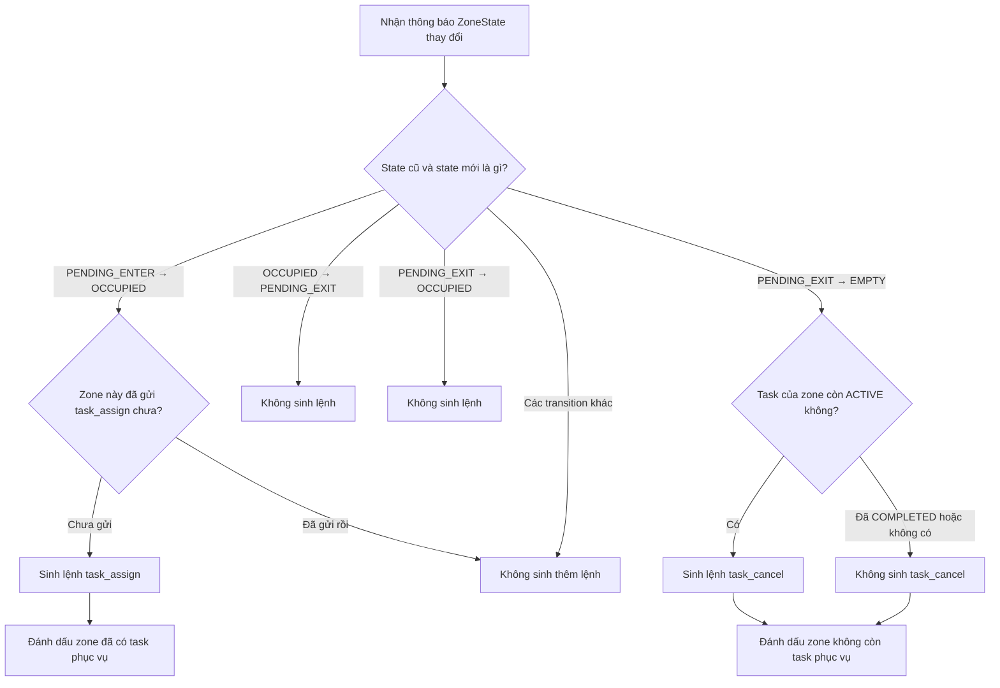

## Trạng thái phục vụ

`ZoneState` phản ánh trạng thái từ vision. Song song với nó, decision engine giữ
`ZoneServiceState` riêng cho từng zone:

- `NOT_REQUESTED`: occupancy hiện tại chưa tạo task.
- `ACTIVE`: task đã được tạo và chưa hoàn tất.
- `COMPLETED`: task đã hoàn tất nhưng zone chưa trở về `EMPTY`.

Khi dispatcher nhận `TaskStatusCode.COMPLETED`, nó gọi
`decision_engine.on_service_completed(zone_id)`. Nhờ trạng thái `COMPLETED`,
transition `PENDING_EXIT -> EMPTY` chỉ reset vòng đời zone mà không sinh một
`task_cancel` không cần thiết.

Lần đầu quan sát một zone chỉ khởi tạo lịch sử và không sinh decision. Mỗi
occupancy chỉ được sinh tối đa một `task_assign`; state phục vụ chỉ trở lại
`NOT_REQUESTED` sau transition xác nhận ra `PENDING_EXIT -> EMPTY`.
