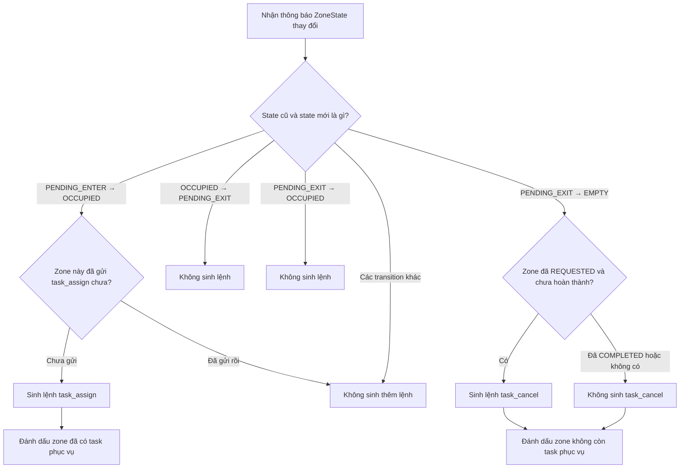

## Trách nhiệm của module

`dispatch_decision` theo dõi transition trạng thái zone và sinh một trong hai
quyết định `TASK_ASSIGN` hoặc `TASK_CANCEL`. Module này không chọn robot, không
cấp `task_id` và không trực tiếp gửi message tới robot.

Các thành phần chính:

- `DispatchDecisionEngine`: điều phối việc đọc state, gọi policy, cập nhật state
  và trả về các `DispatchDecision` phát sinh.
- `ZoneOnlyDecisionPolicy`: ánh xạ transition zone và trạng thái phục vụ thành
  action tương ứng.
- `DispatchDecisionStateStore`: lưu trạng thái zone và trạng thái phục vụ gần
  nhất của từng zone.

## Lần đầu quan sát một zone

Khi engine nhìn thấy một zone lần đầu tiên, nó chỉ lưu `ZoneState` hiện tại và
không sinh decision. Engine cần có cả state trước và state sau mới xác định được
một transition hợp lệ.

Ví dụ, để sinh `TASK_ASSIGN`, engine phải quan sát được đầy đủ:

```text
PENDING_ENTER → OCCUPIED
```

Nếu lần đầu engine nhìn thấy zone đã ở `OCCUPIED`, engine không tự suy luận rằng
zone vừa đi qua `PENDING_ENTER`.

## Thông báo task hoàn thành

Khi tầng xử lý trạng thái robot nhận được thông báo task đã hoàn thành, tầng đó
gọi:

```python
engine.on_service_completed(zone_id)
```

Engine chuyển service của zone từ `REQUESTED` sang `COMPLETED`. Trong lúc zone vẫn
`OCCUPIED`, state `COMPLETED` ngăn engine sinh thêm `TASK_ASSIGN`. Khi zone chuyển
`PENDING_EXIT → EMPTY`, engine reset service về `NOT_REQUESTED` để sẵn sàng cho
lượt phục vụ tiếp theo.

Nếu robot báo task thất bại, tầng robot gọi:

```python
engine.on_service_failed(zone_id)
```

Engine chuyển service từ `REQUESTED` sang `FAILED`. Flow hiện tại không tự retry
nghiệp vụ trong cùng lượt occupancy. Khi zone chuyển `PENDING_EXIT → EMPTY`, state
`FAILED` được reset về `NOT_REQUESTED` giống như `COMPLETED`.

Nếu decision không thể chuyển thành yêu cầu hợp lệ do lỗi cục bộ không thể retry,
ví dụ `goal_pose` thiếu dữ liệu, tầng thực thi gọi:

```python
engine.on_service_request_failed(zone_id)
```

để rollback `REQUESTED` về `NOT_REQUESTED`.

## Contract với tầng thực thi robot

Engine đánh dấu service là `REQUESTED` ngay khi sinh `TASK_ASSIGN`, và reset về
`NOT_REQUESTED` ngay khi sinh `TASK_CANCEL`. Đây là trạng thái decision, không
phải xác nhận rằng robot đã nhận và thực thi message thành công.

Vì engine chỉ sinh mỗi decision một lần, tầng thực thi robot chịu trách nhiệm:

- Chuyển decision thành message tương ứng.
- Gửi message tới robot.
- Retry khi gửi thất bại hoặc chưa nhận được ACK.
- Báo lại cho engine khi task hoàn thành bằng `on_service_completed(zone_id)`.
